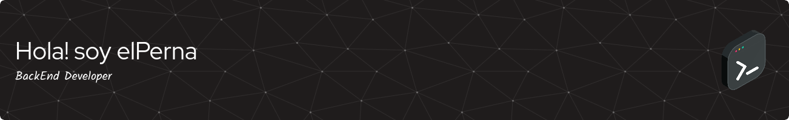

 

# Bienvenido a mi GitHub Site!
Me llamo José Pernalete y soy Ingeniero de Sistemas venezolano 🇻🇪 con 32 años, apasionado por el desarrollo web back-end. Con experiencia en Typescript y Node.js, he construido aplicaciones web escalables y eficientes.  Actualmente estoy explorando el mundo de la web3. Busco un equipo dinámico donde pueda aplicar mis conocimientos y contribuir a proyectos innovadores. ¡Siempre dispuesto a aprender y crecer!

# 💻 Tecnologías que uso actualmente:

# 💻 Tecnologías que estoy en fase de aprendizaje:

# 💻 Tecnologías que estoy interesado en aprender:

# 📊 GitHub Stats:

---

<!-- Proudly created with GPRM ( https://gprm.itsvg.in ) -->

